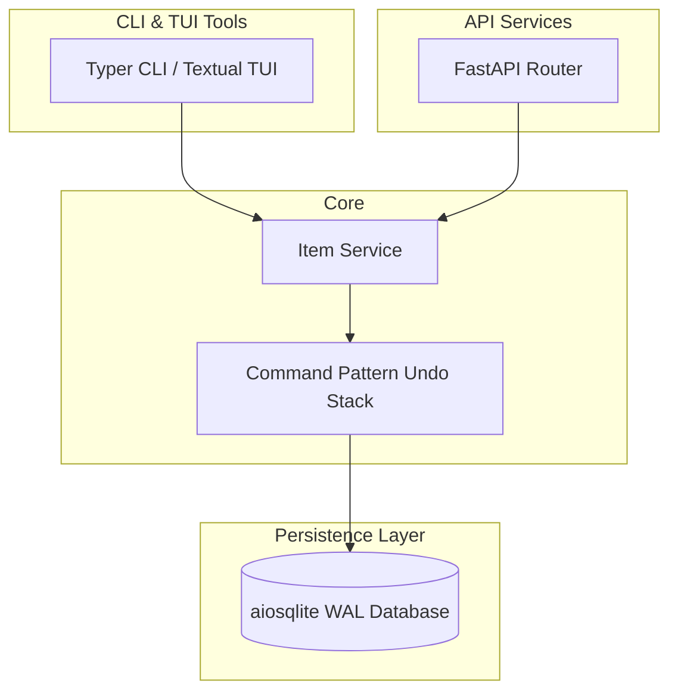

# AcouSense Backend & CLI

[](https://github.com/astral-sh/acousense/actions/workflows/ci.yml)
[]()
[](https://badge.fury.io/py/acousense)


AcouSense Urban Soundscape Intelligence Platform base ecosystem. Built on 2025 modern Python standards: `uv`, `FastAPI`, `SQLite` with `SQLCipher`, `Typer`, `Textual`.

## Quickstart

```bash
# Setup using uv
uv sync --dev
# Run CLI
uv run acousense --help
```

## Architecture



## CLI Reference
| Command | Args | Description |
|---------|------|-------------|
| `list-items` | `--limit INT` | List noise measurement items. |
| `create` | `name`, `desc`, `timestamp` | Create entry with flexible NLP timestamps. |
| `undo` | None | Undo the last mutation securely. |
| `tui` | None | Launch graphical Textual terminal app. |

## API Endpoints
| Method | Path | Auth | Description |
|--------|------|------|-------------|
| GET | `/api/items` | X-API-Key | List entries |
| POST | `/api/items` | X-API-Key | Create entry |
| DELETE | `/api/items/{id}` | X-API-Key | Soft delete |
| POST | `/api/items/{id}/undo` | X-API-Key | Undo an explicit action |
| GET | `/api/history` | X-API-Key | Retrieve command mutation payloads |
| GET | `/health` | None | Service liveness |

## Deployment
Use `docker compose up -d` for development.
Production deployments use the multi-stage Distroless Kubernetes manifests `kubectl apply -f k8s.yaml`. 

**Why SQLite?**
SQLite provides exceptional I/O for 99% of CLI & single-node server tasks. However, doing so requires `replicas: 1` constraint on Kubernetes pods to avoid filesystem corruptions from concurrent writers. If your system exceeds 100K R/W per second bounding or demands horizontal scaling, migrate backends to PostgreSQL.

## Newman Testing
```bash
newman run postman_collection.json --env-var "base_url=http://localhost:8000" --env-var "api_key=your_key"
```

## Security
See `SECURITY.md` for information on `keyring` usage.
