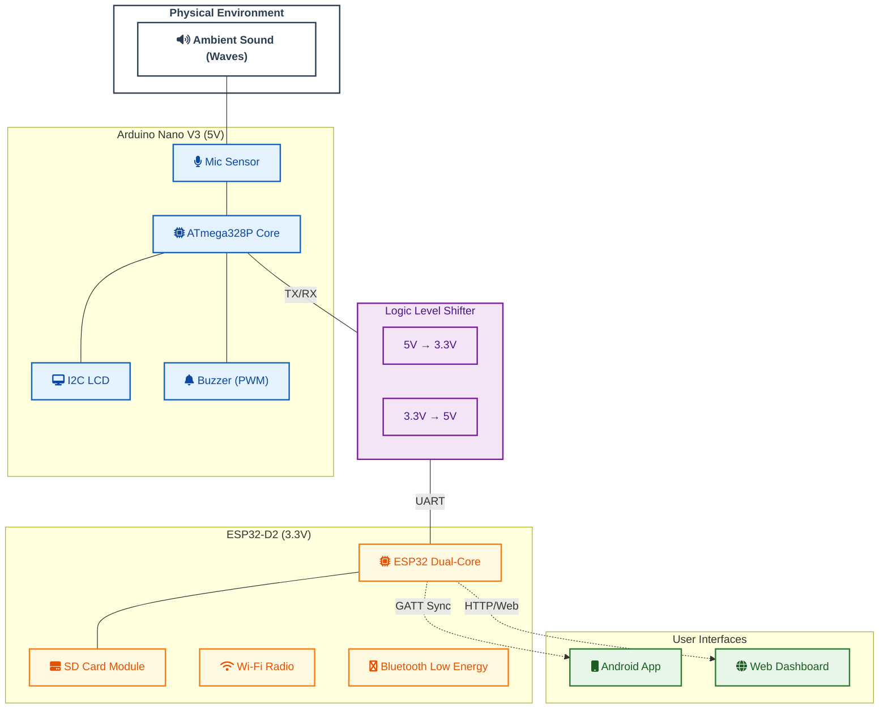
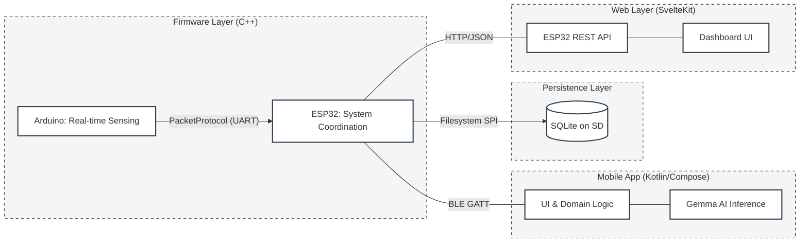
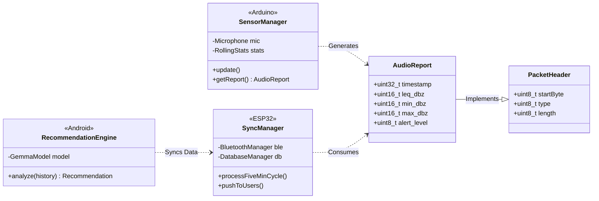
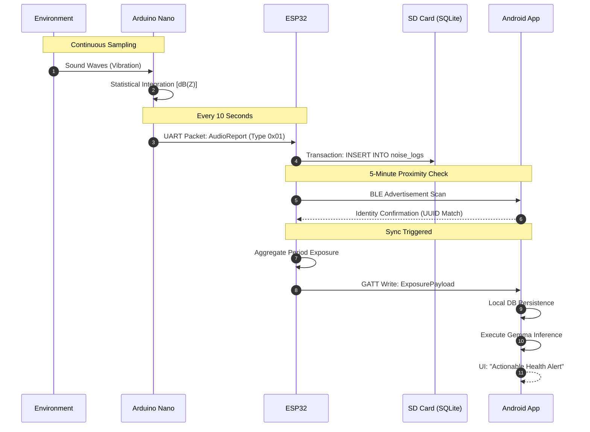

# AcouSense — System UML Diagrams

This document provides a comprehensive technical overview of the AcouSense ecosystem, covering hardware topology, software architecture, and data flow.

---

## 1. Hardware Deployment Diagram

This diagram illustrates the physical components and their electrical/wireless interconnections. It highlights the dual-microcontroller architecture and the transition to UART communication.

---

## 2. Software Component Diagram

The following diagram represents the modular decomposition of the software ecosystem and the interfaces between subsystems.

---

## 3. Logical Class Diagram (Core Abstractions)

Focuses on the "Manager" architectural pattern used in the firmware and the data contracts.

---

## 4. System Sequence Diagram (Data Lifecycle)

Traces a noise measurement from the physical world to the user's phone, illustrating the periodic synchronization model.

